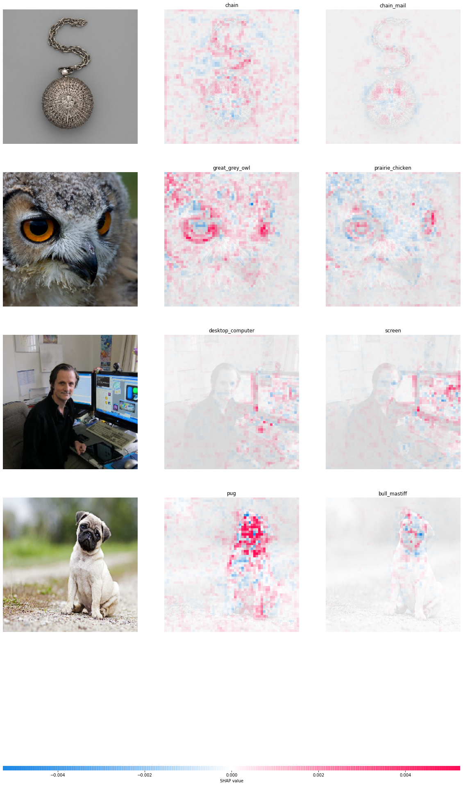
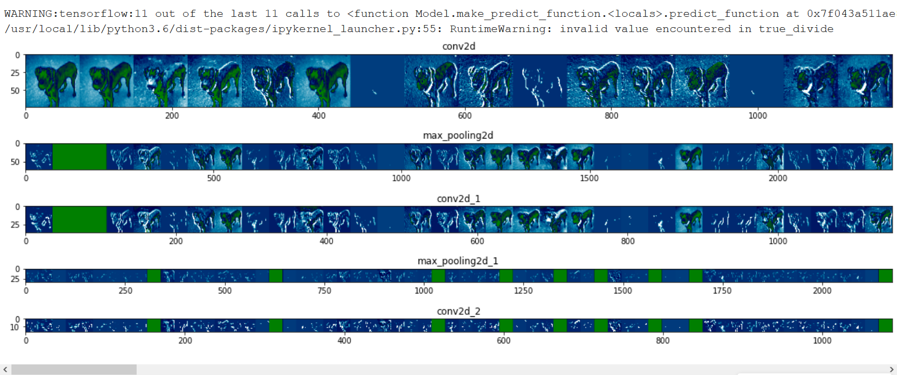

# Explainable AI

Several ways have been proposed to explain decisions of AI models. This repository contains some of those ways.

##Files
### Computer vision
 - GradCam 
   - Pretrained models
   - Custom deisgned models	
 - SHAP values
 - Saliency maps 
   - pytorch implementation
   - Keras implementation
 - Visualize CNN Filters - Fastai
   - Tensorflow implementation
   - Fastai implementation 

