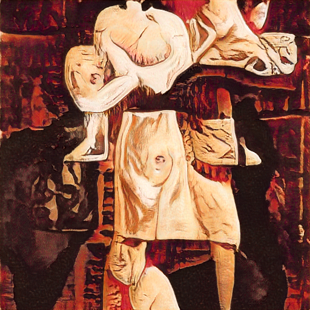

# Generative Adverserial networks(GANs)

##Files

### Variational autoencoders
 - Convolutional variational autoencoders
### GANs
 - DCGANs 
   - MNIST dataset generation
   - CIFAR-10 dataset generation	
 - Cycle GANs
   - Zebra to horse transition
   - Understanding disease progression
     - Pneumonia disease
     - Skin lesion diseases
 - Style transfer
 - Pix2Pix
  

