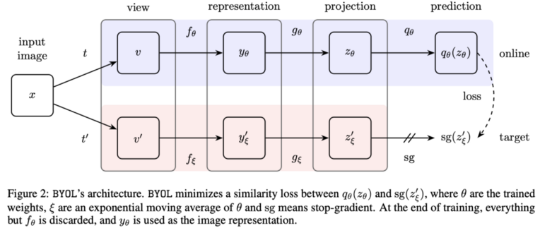

# BYOL (Bootstrap your own Latent) - Self-Supervised learning

## Aim - Compare accuracy of self-supervised learning vs Supervised learning algorithms in Medical imaging tasks. 
[Paper link](https://arxiv.org/abs/2006.07733)

- Area - Computer vision
- Type of algorithm - Self supervised learning
- Language - Python
- Modules - Pytorch

## Why self-supervised learning? 
Labeled data is hard to get, especially in medical imaging. The ability to use learn model labels all by itself would boost applications where AI can help ease the workflow.

## Why BYOL approach? 
BYOL approach eliminates the need for a negative image. BYOL paper was able to achieve state-of-the-art results in self-supervised learning models.

## Experiment Details
- Self supervised Base model used  - BYOL + ResNet50
- Supervised model for comparison  - ResNet50
- Tasks
  - 1. Radiology - Pneumonia vs  Normal chest xrays
  - 2. Radiology - Hemorrhage vs  Normal Head CT scans
  - 3. Skin dataset - Melanoma detection

## Notebooks
- [x] [Intro to BYOL]('https://github.com/Amritpal-001/Paper_Implementations/edit/master/self_supervised/BYOL/BYOL_Understanding_model.ipynb')
- [x] [Pneumonia - BYOL + ResNet]('https://github.com/Amritpal-001/Deep-learning/blob/master/self_supervised/BYOL/Self_Supervised_learning%20-%20Pneumonia%20classify.ipynb')
- [ ] [Melanoma BYOL + ResNet]()

## Datasets used

| Dataset  | Type of task | No. of classes  | No of total images | Dataset link | code | 
| :---         |     :---:      | :---:      |          ---: |   ---: |---: |
|  Pneumonia | Binary classfication  | 2  | 5856 | [link](https://www.kaggle.com/paultimothymooney/chest-xray-pneumonia) |  [link]('https://github.com/Amritpal-001/Deep-learning/blob/master/self_supervised/BYOL/Self_Supervised_learning%20-%20Pneumonia%20classify.ipynb') | 
|  Hemmorahge detection | Binary classfication  | 2  | 44.1k | [link](https://www.kaggle.com/felipekitamura/head-ct-hemorrhage) |  [link]('https://github.com/Amritpal-001/Deep-learning/blob/master/self_supervised/BYOL/Self_Supervised_learning%20-%20Pneumonia%20classify.ipynb') |  
|  Melanoma detection | Multiclass classfication  | 5  | 44.1k | [link](https://www.kaggle.com/cdeotte/jpeg-melanoma-192x192) |   |  

## Experiment 1 - Confusion matrix
### BYOL - Hemorrahge 

### BYOL - Pneumonia

### Hemorrahge_BYOL_loss graph

## Results

| Dataset  | Model 1 accuracy | Model 1 loss | Model 2 accuracy | Model 2 loss | 
| :---         |     :---:      |          ---: |   ---: |          ---: |
|  Pneumonia |   |  | | |
|  Melanoma detection | |  | | |

## Project Directory 

## Implementations of BYOL
- https://github.com/lucidrains/byol-pytorch
- https://github.com/deepmind/deepmind-research/tree/master/byol
- https://github.com/sthalles/PyTorch-BYOL
