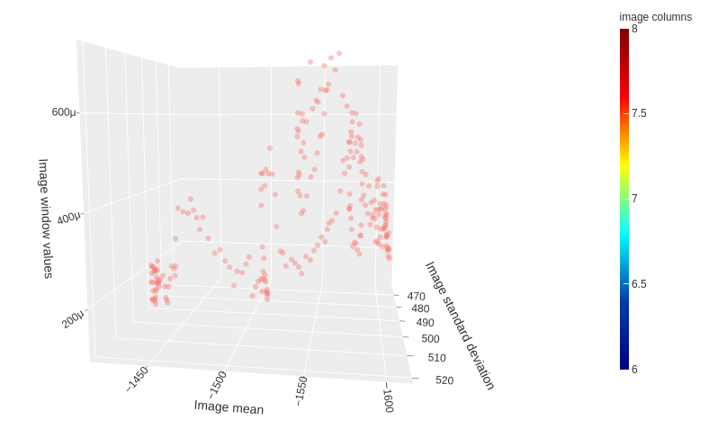
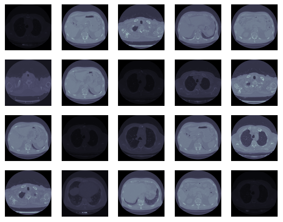
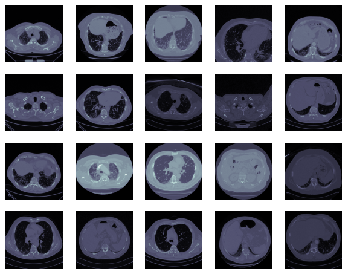

# OSIC Pulmonary Fibrosis Progression

### Predict lung function decline

[Competition webpage](https://www.kaggle.com/competitions/osic-pulmonary-fibrosis-progression)

Evaluation metric - modified version of the Laplace Log Likelihood.

## Aim

The aim of this competition is to predict a patient’s severity of decline in lung function based on a CT scan of their lungs. Lung function is assessed based on output from a spirometer, which measures the forced vital capacity (FVC), i.e. the volume of air exhaled.

## Data provided  - 

Training data 
 - Baseline chest CT scan ( Week = 0 and has numerous follow up visits)
 - Associated clinical information for a set of patients. (smoking, sex, Age)
 - Entire history of FVC measurements.
 
Test data
 - Baseline CT scan
 - Initial FVC measurement. 
 
Goal - Predict the final three FVC measurements for each patient, as well as a confidence value in your prediction.

## Approach used -

Average weighted ensemble of EfficientNet models

## Feature engineering and selection

## Images

 
 

