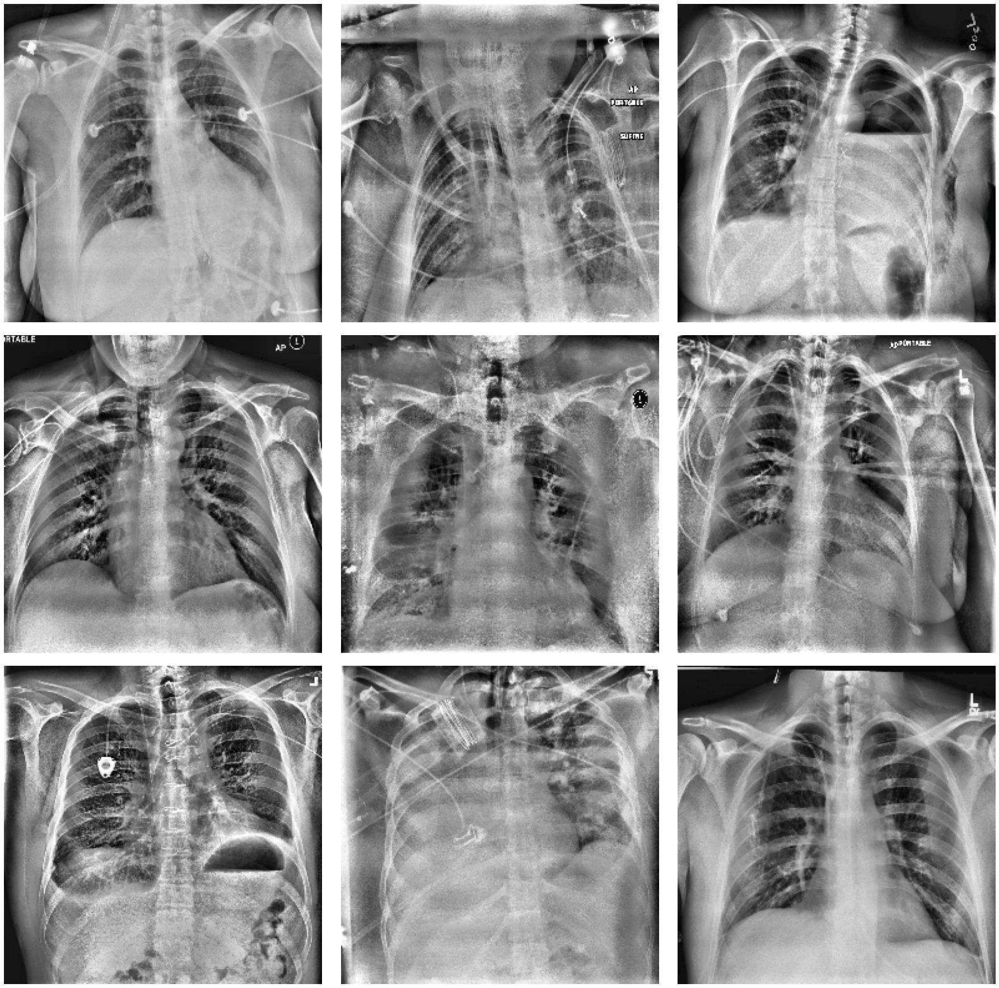
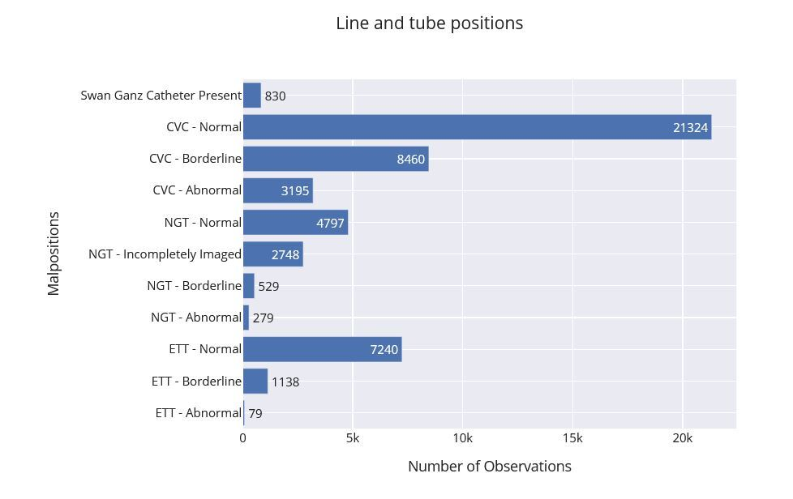
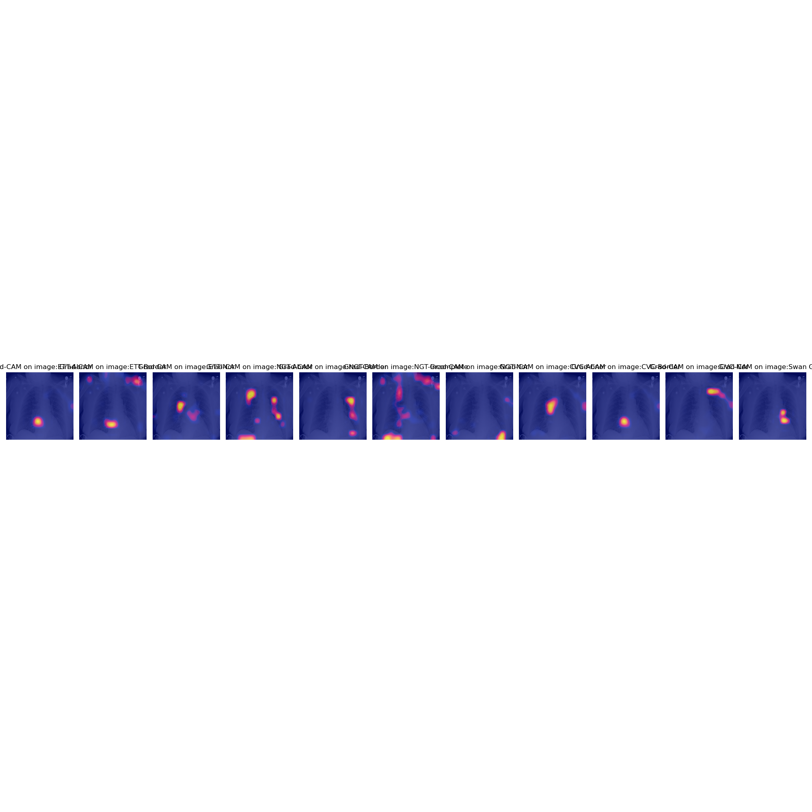
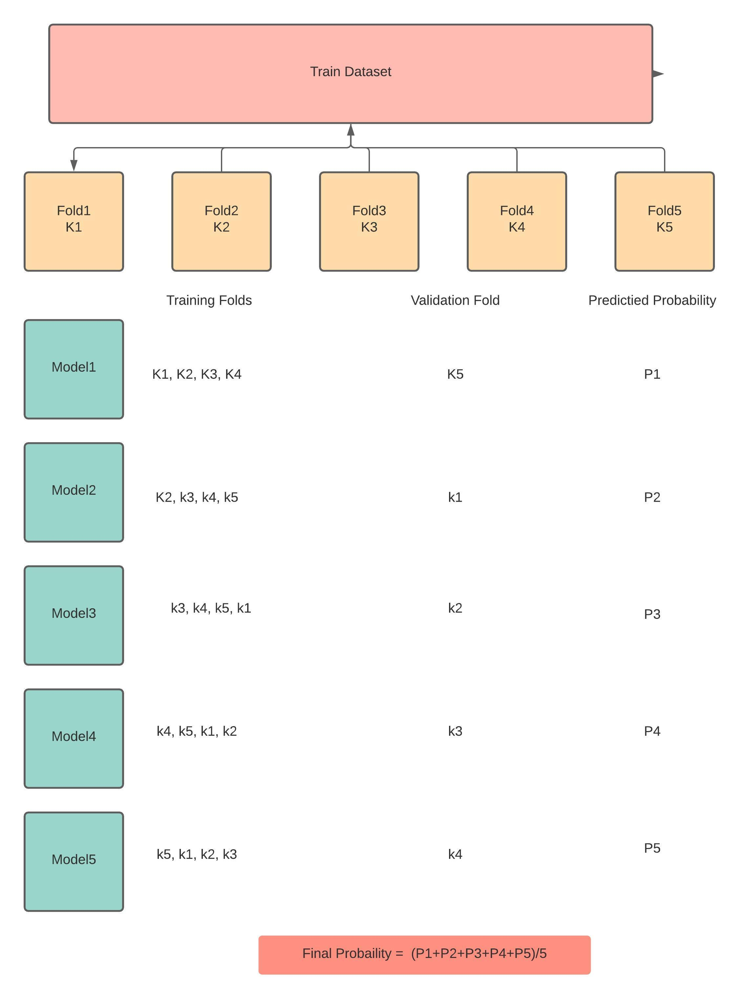
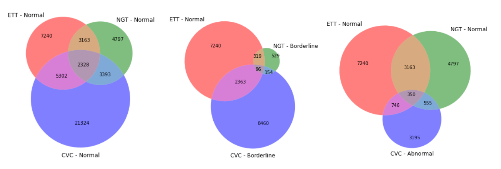
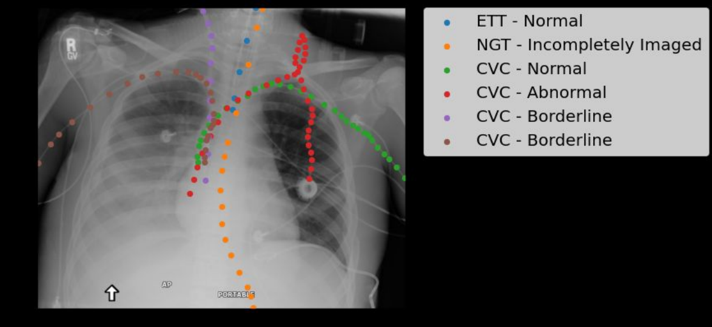

# RANZCR CLiP - Catheter and Line Position Challenge

### Classify the presence and correct placement of tubes on chest x-rays to save lives

[Competition webpage](https://www.kaggle.com/competitions/ranzcr-clip-catheter-line-classification/overview)

Evaluation metric - modified version of the Laplace Log Likelihood.

## Aim

1. Detect Catheter on Chest Xrays into Endotracheal tube, Nasogastric catheter, CVC 
2. Detect is the catheter in Normal(functionally), Abnormal(Needs to be replaced) or boderline

Classification problem with 14 classes.

## Data provided  - 

40,000 images, along with binary labels for

    StudyInstanceUID - unique ID for each image
    ETT - Abnormal - endotracheal tube placement abnormal
    ETT - Borderline - endotracheal tube placement borderline abnormal
    ETT - Normal - endotracheal tube placement normal
    NGT - Abnormal - nasogastric tube placement abnormal
    NGT - Borderline - nasogastric tube placement borderline abnormal
    NGT - Incompletely Imaged - nasogastric tube placement inconclusive due to imaging
    NGT - Normal - nasogastric tube placement borderline normal
    CVC - Abnormal - central venous catheter placement abnormal
    CVC - Borderline - central venous catheter placement borderline abnormal
    CVC - Normal - central venous catheter placement normal
    Swan Ganz Catheter Present
    PatientID - unique ID for each patient in the dataset

Evalution metrics - AUC-ROC 

## Approach used -

Average weighted ensemble of DenseNet and EfficientNet models

## Feature engineering and selection
|  |

## Images

 
 
 
 
|  |

